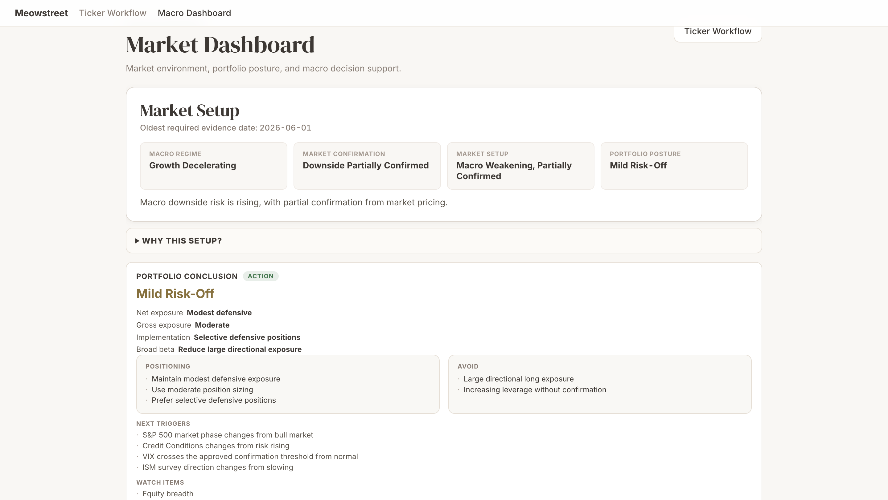
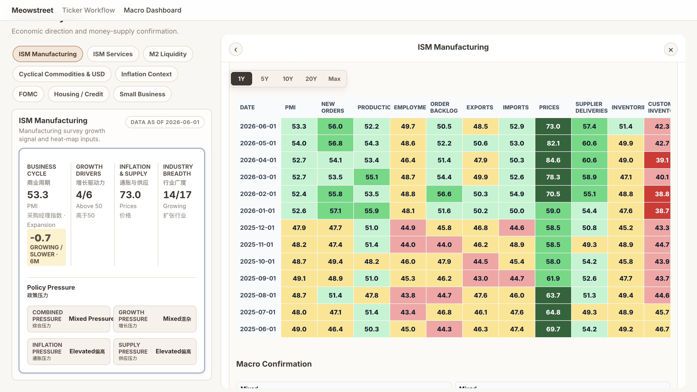

# Meowstreet

Meowstreet is a local-first trade workflow console for assessing market context, reviewing a ticker, and identifying the next research or risk-management step.

## What it does

- Brings market context and macro signals into one workspace
- Organizes ticker research into a repeatable workflow
- Shows process readiness, missing inputs, and next actions

## Screenshots



## Run locally

Create a virtual environment, install dependencies, and start the server:

```bash
python3 -m venv .venv
.venv/bin/pip install -r requirements.txt
.venv/bin/uvicorn app.api:app --reload --port 8797 --workers 2
```

Open `http://127.0.0.1:8797` in your browser.

## Test

Run the test suite:

```bash
.venv/bin/pytest -q
```

## Local data

Meowstreet keeps application data on your machine. Store API credentials and other sensitive settings in `.env`; Git ignores this file.
